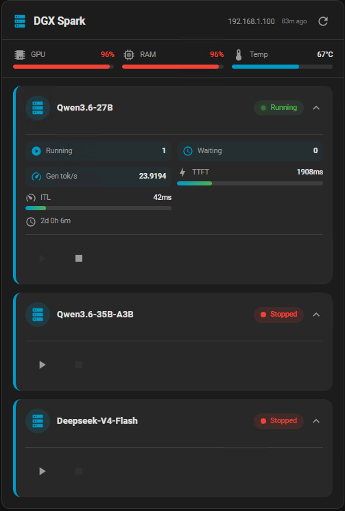

# AI Server Card

A custom Home Assistant Lovelace card for managing AI inference servers. Monitor status, GPU/RAM/temperature metrics, and control services directly from your dashboard.


## Screenshots



## Features

- **Service Status** — Real-time status badges (running, stopped, starting, restarting, paused, unknown)
- **Optimistic UI** — Status updates instantly after action (start/stop/restart), reverts on error
- **Toast Notifications** — Visual feedback on every action (success/error)
- **Server Metrics** — Shared GPU/RAM/temperature bars for multi-model setups
- **Per-Service Metrics** — GPU usage, VRAM, temperature, model info per service
- **LLM Performance** — Running, waiting, TTFT, ITL (inter-token latency) and tokens/iter per service
- **Expand/Collapse** — Collapsible per-service metrics with animated chevron (compact mode collapses by default)
- **Last Updated** — Relative "last update" timestamp in the header
- **Entity Warning** — Orange indicator when an entity is unavailable
- **Host Custom Actions** — Add arbitrary buttons (with icons) that call any HA service, rendered at the server level
- **Service Controls** — Start, stop, restart, logs with one click; buttons disabled during transitions
- **Manual Refresh** — Force-refresh button to sync card with current HA state
- **i18n** — French/English translations auto-detected from HA language (`hass.language`)
- **Mushroom Style** — Clean, modern design matching the Mushroom card ecosystem
- **Configurable** — Custom refresh interval, compact mode, show/hide individual metrics
- **Multi-Service** — Manage multiple AI services (vLLM, Ollama, llama.cpp, ds4-server, etc.)

## Installation

### Manual

1. Copy `dist/llm-server-card.js` to `/config/www/community/ha-ai-server-card/` on your HA instance
2. Add the resource in **Settings → Devices & Services → Helpers → Resources** (or via UI: Dashboard → ⚙️ → Resources)
   - URL: `/community/ha-ai-server-card/llm-server-card.js`
   - Resource Type: `module`
3. Add the card to your dashboard

## Quick Setup

### 1. SSH Key

Copy your SSH private key to HA so it can reach the AI server:

```bash
scp /path/to/ssh_key hassio@YOUR-HA-IP:/config/ssh_ai_server
ssh hassio@YOUR-HA-IP "chmod 600 /config/ssh_ai_server"
```

### 2. Sensors & Commands

Copy `sensors-ai-server.yaml` and `shell_command-ai-server.yaml` to `/config/` on HA, then:

1. **Edit** both files: replace `USER@AI-SERVER-HOST`, paths, and ports with your values
2. **Include** in `configuration.yaml`:
   ```yaml
   sensor: !include sensors-ai-server.yaml
   shell_command: !include shell_command-ai-server.yaml
   ```
3. **Restart** Home Assistant

### 3. LLM Metrics Script (Recommended)

The `scripts/llm_metrics.sh` script provides a single JSON sensor for all inference metrics. It **auto-detects** whether the backend is vLLM or ds4-server — and adapts accordingly.

**Setup:**
1. Copy `scripts/llm_metrics.sh` to your AI server (e.g. `/config/scripts/llm_metrics.sh`)
2. **Edit the script**: replace `USER@AI-SERVER-HOST` and `/config/ssh_ai_server` with your actual SSH credentials
3. Make executable: `chmod +x /config/scripts/llm_metrics.sh`
4. Create a sensor in `sensors-ai-server.yaml`:
   ```yaml
   - platform: command_line
     name: "LLM Metrics"
     command: "bash /config/scripts/llm_metrics.sh 10002 'your-model-name'"
     json_attributes:
       - running
       - waiting
       - ttft
       - itl
       - tokens
       - ctx
       - model
       - uptime
     scan_interval: 15
     value_template: "{{ value_json.running | default(0) }}"
   ```

**Usage:** `llm_metrics.sh PORT [MODEL]`
- `PORT` — metrics endpoint port (e.g. `10002`)
- `MODEL` — model name for vLLM filtering (ignored for ds4-server)

**Output:** `{"running":3,"waiting":0,"ttft":450,"itl":85,"tokens":256,"ctx":12000,"model":"Qwen3.6-27B","uptime":86400}`

| Field | Description |
|-------|-------------|
| `running` | Concurrent requests |
| `waiting` | Queue depth |
| `ttft` | Time to First Token (ms) |
| `itl` | Inter-Token Latency (ms) |
| `tokens` | Tokens per iteration |
| `ctx` | Context length (derived) |
| `model` | Serving model (auto-detected from `/v1/models`) |
| `uptime` | Process uptime (seconds) |

### 4. Card Configuration

```yaml
type: custom:llm-server-card
server:
  name: AI Server
  metrics:  # Shared server-level metrics (displayed once)
    gpu_entity: sensor.ai_gpu_usage
    memory_entity: sensor.ai_uma_memory_usage
    temperature_entity: sensor.ai_gpu_temperature
services:
  - name: "Service 1"
    icon: "mdi:cpu-64-bit"
    color: "#4fc3f7"
    status_entity: sensor.service_1_status
    model_entity: sensor.service_1_model
    uptime_entity: sensor.service_1_uptime
    metrics_entity: sensor.llm_metrics_1
    start_service: shell_command.service_1_start
    stop_service: shell_command.service_1_stop
    restart_service: shell_command.service_1_restart
    logs_service: shell_command.service_1_logs
options:
  refresh_interval: 15
  compact: true
```

## Configuration Options

### Server

| Option | Type | Default | Description |
|--------|------|---------|-------------|
| `server.name` | string | — | Server display name |
| `server.metrics` | object | — | Shared server-level metrics |
| `server.metrics.gpu_entity` | string | — | GPU usage entity (%) |
| `server.metrics.memory_entity` | string | — | RAM/VRAM usage entity (%) |
| `server.metrics.temperature_entity` | string | — | Temperature entity (°C) |
| `server.customActions` | array | — | Host-level custom actions (see below) |

### Host Custom Actions

Add buttons that call any HA service (e.g. `shell_command.*`) rendered at the server level:

```yaml
type: custom:llm-server-card
server:
  name: DGX Spark
  customActions:
    - name: "Restart NGINX"
      service: shell_command.nginx_restart
      icon: "mdi:nginx"
    - name: "Clean cache"
      service: shell_command.clean_cache
      icon: "mdi:delete-scan"
```

In the visual editor, use the "Host Custom Actions" section. The icon field auto-completes ~70 MDI icons.

### Services

| Option | Type | Default | Description |
|--------|------|---------|-------------|
| `services[].name` | string | — | Service display name |
| `services[].icon` | string | auto | MDI icon name |
| `services[].color` | string | — | Custom service color (hex) |
| `services[].status_entity` | string | — | HA entity for status |
| `services[].model_entity` | string | — | HA entity for current model |
| `services[].metrics_entity` | string | — | HA entity for inference performance (JSON: running, waiting, ttft, itl, tokens, ctx, model, uptime) |
| `services[].uptime_entity` | string | — | HA entity for uptime |
| `services[].start_service` | string | — | HA service to start |
| `services[].stop_service` | string | — | HA service to stop |
| `services[].restart_service` | string | — | HA service to restart |
| `services[].logs_service` | string | — | HA service to show logs |

### Display Options

| Option | Type | Default | Description |
|--------|------|---------|-------------|
| `options.show_server_metrics` | boolean | `true` | Show shared server metrics |
| `options.show_gpu` | boolean | `true` | Show GPU usage |
| `options.show_ram` | boolean | `true` | Show RAM/VRAM usage |
| `options.show_temp` | boolean | `true` | Show temperature |
| `options.show_uptime` | boolean | `true` | Show uptime |
| `options.show_model` | boolean | `true` | Show current model |
| `options.show_actions` | boolean | `true` | Show action buttons |
| `options.show_performance` | boolean | `true` | Show LLM performance section |
| `options.show_running` | boolean | `true` | Show running requests |
| `options.show_waiting` | boolean | `true` | Show waiting queue |
| `options.show_ttft` | boolean | `true` | Show TTFT |
| `options.show_itl` | boolean | `true` | Show ITL |
| `options.show_tok_iter` | boolean | `true` | Show tokens/iter |
| `options.refresh_interval` | number | `30` | Auto-refresh interval (seconds) |
| `options.compact` | boolean | `false` | Compact display mode |

## DGX Spark (UMA) Notes

DGX Spark uses **Unified Memory Architecture (UMA)** where CPU and GPU share a 128GB memory pool:

- `nvidia-smi --query-gpu=memory.used` returns `[N/A]` — use `free -m` instead
- GPU usage and temperature work normally with `nvidia-smi`
- Sensor example for UMA memory:
  ```yaml
  - platform: command_line
    name: "Spark UMA Memory Usage"
    command: >
      ssh -i /config/ssh_key user@server
      "free -m | awk 'NR==2{printf \"%.1f\", \$3/\$2*100}'"
    unit_of_measurement: "%"
  ```

## Sensor Commands Reference

| Sensor | Command | Interval |
|--------|---------|----------|
| GPU Usage | `nvidia-smi --query-gpu=utilization.gpu` | 15s |
| GPU Temp | `nvidia-smi --query-gpu=temperature.gpu` | 30s |
| UMA Memory | `free -m \| awk 'NR==2{printf "%.1f", \$3/\$2*100}'` | 15s |
| LLM Status | `docker inspect --format='{{.State.Status}}' vllm` | 30s |
| LLM Model | `curl localhost:8000/v1/models \| jq` | 5min |
| LLM Metrics | `bash /config/scripts/llm_metrics.sh 10002 'model'` | 15s |

## License

This project is licensed under the MIT License — see the [LICENSE](LICENSE) file for details.

## Credits

- Inspired by the [Mushroom](https://github.com/piitaya/lovelace-mushroom) card ecosystem
- Built with [Lit](https://lit.dev/) and [Vite](https://vitejs.dev/)
